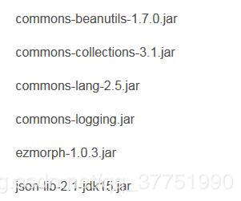
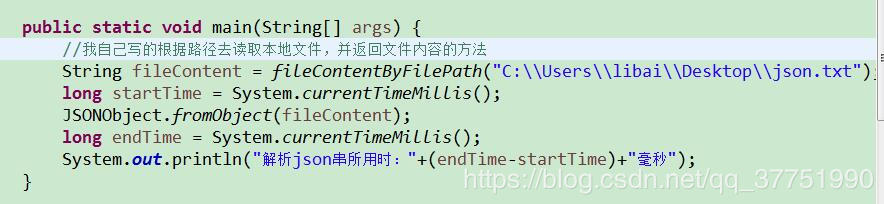
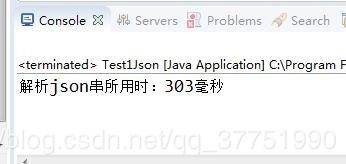
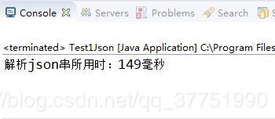

## 背景
最近小编在做公司的一个需求。要求是把系统内的一些大型文本文件上传到第三方那里，而且第三方要求的交互数据的方式是采用post请求发送json串的形式进行的。 
 
<!--more--> 
## 问题  
做到中途才发现问题，由于单个文本都有一两兆的大小，一次请求要传四五个文件，这些文件内容和其它要传输的参数加起来就有七八兆了。  
当时我是用的最常用的json解析的方法，就是下图所用的jar里面的方法。  
  

现在，我做个测试。我桌面上有个三兆多的json字符串的文件，我读取这个文件，并把文件内容用**JSONObject.fromObject**方法去解析它。 
  

运行得到的结果如下：  
  

三兆的文件，所用了三百多毫秒。我真实项目里为了组装数据，还得互相嵌套集合，最后是把那个装满数据的集合解析成json串，这时的速度特别慢，至少有五六秒的时间。  
## 解决方法  
了解决json解析慢的问题，我上网查了些资料，找到了一款新的json解析的工具，**就是阿里的一位大神写的解析json的工具，叫FastJson**，速度比原来的相比，快了一大截。  
这是我用的fastjson版本  

用了**FastJson**解析的用时如下：  
  

可以看到，快了一倍，这在处理多文件上传时能节省不少的时间。  
## 最后  
**下篇文章我就整理下FastJson的一些基本用法，供大家参考。**